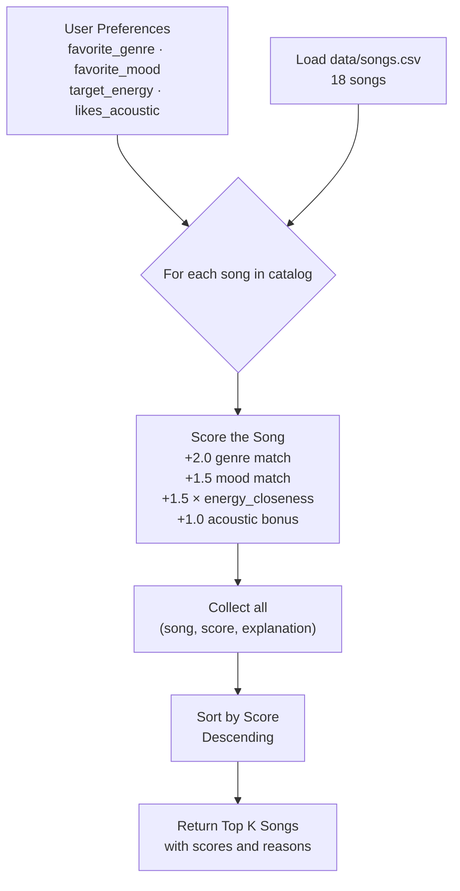

# 🎵 Music Recommender Simulation

## Project Summary

In this project I built a content-based music recommender that simulates how platforms like Spotify decide what to play next. My version takes a user's preferred genre, mood, energy level, and acoustic preference, then scores every song in the catalog against those preferences using a weighted formula. Songs are ranked by score and the top results are returned as personalized suggestions. The system is intentionally simple so the decision-making process stays visible and explainable, unlike the black-box models used at scale in production apps.

---

## How The System Works

### How Real-World Recommendation Systems Work

Major streaming platforms use two main approaches to predict what users will love:

**Collaborative filtering** — "Users like you also liked this." The system looks at the listening history of thousands of users and finds patterns. If many people who enjoy the same songs as you also love a particular track, it recommends that track to you — even if the song has nothing obviously in common with your past listens. Spotify's Discover Weekly is a well-known example of this approach.

**Content-based filtering** — "This song has the same vibe as what you already like." The system analyzes attributes of the songs themselves — genre, tempo, mood, energy, acousticness — and recommends songs whose features closely match the user's taste profile. TikTok and YouTube use this heavily when a user is new and there isn't enough behavior data yet.

Real platforms combine both approaches (called a hybrid system) and also factor in signals like skips, replays, playlist additions, time of day, and even geolocation. The key data types involved are:
- **Behavioral signals**: likes, skips, play counts, playlist adds, listening duration
- **Song attributes**: tempo (BPM), energy, valence (positivity), danceability, genre, mood, acousticness
- **User context**: time of day, device, location, recently played

My version uses **content-based filtering only**, which keeps the logic transparent and inspectable.

---

### My Version: Features and Scoring

**`Song` object features:**
| Feature | Type | Description |
|---|---|---|
| `genre` | string | Music genre (pop, lofi, rock, jazz, etc.) |
| `mood` | string | Emotional tone (happy, chill, intense, relaxed, moody, focused) |
| `energy` | float (0–1) | How energetic the track feels |
| `tempo_bpm` | float | Beats per minute |
| `valence` | float (0–1) | Musical positiveness |
| `danceability` | float (0–1) | How suitable the song is for dancing |
| `acousticness` | float (0–1) | How acoustic vs. electronic the song is |

**`UserProfile` object stores:**
- `favorite_genre` — the genre the user prefers most
- `favorite_mood` — the mood/vibe the user is looking for
- `target_energy` — how energetic a song the user wants (0–1)
- `likes_acoustic` — whether the user prefers acoustic over electronic sounds

**Scoring Rule (for one song):**

A song's score is computed as a sum of weighted matches:

```
score = 0.0

if song.genre == user.favorite_genre:
    score += 3.0          # Genre is the strongest signal

if song.mood == user.favorite_mood:
    score += 2.0          # Mood match is second most important

energy_closeness = 1.0 - abs(user.target_energy - song.energy)
score += 2.0 * energy_closeness   # Rewards proximity, not just high/low energy

if user.likes_acoustic and song.acousticness > 0.6:
    score += 1.0          # Acoustic bonus for users who prefer it
```

Maximum possible score: **8.0**. Genre is worth the most because it is the broadest filter — a rock fan and a lofi fan will rarely enjoy the same songs regardless of energy or mood.

**Ranking Rule (for the full catalog):**

After scoring every song individually, the list is sorted in descending order by score. The top `k` songs (default 5) are returned as recommendations. This is the step that transforms individual scores into a ranked recommendation list.

---

### Data Flow Diagram



The key distinction is between the **Scoring Rule** (evaluates one song at a time and produces a number) and the **Ranking Rule** (compares all scores together to decide the final order). You need both steps — scoring alone doesn't tell you which songs to pick until you rank them relative to each other.

---

### Sample User Profile

This is the profile used in `src/main.py` as the default test case. It is specific enough to clearly separate "intense rock" (high energy, intense mood, electric) from "chill lofi" (low energy, chill mood, acoustic):

```python
user_prefs = {
    "favorite_genre": "lofi",       # exact match only — "lofi" won't match "indie pop"
    "favorite_mood":  "chill",      # exact match only — "chill" won't match "relaxed"
    "target_energy":  0.40,         # mid-low energy target
    "likes_acoustic": True,         # adds +1.0 to songs with acousticness > 0.6
}
```

A rock/intense user would look like `{"favorite_genre": "rock", "favorite_mood": "intense", "target_energy": 0.90, "likes_acoustic": False}` — showing how the same formula produces completely different rankings from different profiles.

---

### Known Biases and Expected Limitations

| Bias | Why it happens | Effect |
|---|---|---|
| **Genre lock-in** | Genre match gives the highest weight (+2.0) | A great song in a different genre can never outscore a mediocre same-genre song |
| **Exact mood matching** | Mood is categorical, not a spectrum | "relaxed" and "chill" score identically to "angry" — no partial credit for close moods |
| **Energy math is linear** | We use absolute difference, not a curve | A song at 0.80 energy scores better than one at 0.90 for a user targeting 0.85 — but both feel similarly high-energy to a human |
| **Acoustic users are privileged** | Only `likes_acoustic=True` gets a bonus | Users who dislike acoustic music get no equivalent negative signal — the system can't penalize acoustic songs |
| **Catalog is tiny and Western-biased** | 18 songs, curated by the developer | Genres like Afrobeats, K-pop, or classical Hindustani are completely absent; the system cannot recommend what isn't in the catalog |

The most consequential bias is **genre lock-in**: if a user's favorite genre has few songs in the catalog, they will receive near-identical results every time, creating a filter bubble.

---

## Getting Started

### Setup

1. Create a virtual environment (optional but recommended):

   ```bash
   python -m venv .venv
   source .venv/bin/activate      # Mac or Linux
   .venv\Scripts\activate         # Windows

2. Install dependencies

```bash
pip install -r requirements.txt
```

3. Run the app:

```bash
python -m src.main
```

### Running Tests

Run the starter tests with:

```bash
pytest
```

You can add more tests in `tests/test_recommender.py`.

---

## Terminal Output

Running `python -m src.main` with the default `lofi / chill / energy=0.40 / acoustic=True` profile:

```
Loaded 18 songs.

========================================================
  Top Recommendations
  Profile: genre=lofi | mood=chill | energy=0.4 | acoustic=True
========================================================

#1  Midnight Coding  by  LoRoom
     Score : 5.97 / 6.00
     - genre match: lofi (+2.0)
     - mood match: chill (+1.5)
     - energy proximity: 0.42 vs target 0.40 (+1.47)
     - acoustic match: acousticness=0.71 (+1.0)

#2  Library Rain  by  Paper Lanterns
     Score : 5.92 / 6.00
     - genre match: lofi (+2.0)
     - mood match: chill (+1.5)
     - energy proximity: 0.35 vs target 0.40 (+1.42)
     - acoustic match: acousticness=0.86 (+1.0)

#3  Focus Flow  by  LoRoom
     Score : 4.50 / 6.00
     - genre match: lofi (+2.0)
     - energy proximity: 0.40 vs target 0.40 (+1.5)
     - acoustic match: acousticness=0.78 (+1.0)

#4  Spacewalk Thoughts  by  Orbit Bloom
     Score : 3.82 / 6.00
     - mood match: chill (+1.5)
     - energy proximity: 0.28 vs target 0.40 (+1.32)
     - acoustic match: acousticness=0.92 (+1.0)

#5  Coffee Shop Stories  by  Slow Stereo
     Score : 2.46 / 6.00
     - energy proximity: 0.37 vs target 0.40 (+1.46)
     - acoustic match: acousticness=0.89 (+1.0)
```

The top two results (Midnight Coding and Library Rain) score near-perfect because they match on all four signals: genre, mood, energy proximity, and acoustic preference. Focus Flow drops to 4.50 because it is tagged `focused` not `chill`, so it misses the mood bonus. Spacewalk Thoughts and Coffee Shop Stories appear despite having different genres because their energy level and acousticness keep them in range for an acoustic-loving, low-energy user.

---

## Experiments You Tried

Use this section to document the experiments you ran. For example:

- What happened when you changed the weight on genre from 2.0 to 0.5
- What happened when you added tempo or valence to the score
- How did your system behave for different types of users

---

## Limitations and Risks

Summarize some limitations of your recommender.

Examples:

- It only works on a tiny catalog
- It does not understand lyrics or language
- It might over favor one genre or mood

You will go deeper on this in your model card.

---

## Reflection

Read and complete `model_card.md`:

[**Model Card**](model_card.md)

Write 1 to 2 paragraphs here about what you learned:

- about how recommenders turn data into predictions
- about where bias or unfairness could show up in systems like this


---

## 7. `model_card_template.md`

Combines reflection and model card framing from the Module 3 guidance. :contentReference[oaicite:2]{index=2}  

```markdown
# 🎧 Model Card - Music Recommender Simulation

## 1. Model Name

Give your recommender a name, for example:

> VibeFinder 1.0

---

## 2. Intended Use

- What is this system trying to do
- Who is it for

Example:

> This model suggests 3 to 5 songs from a small catalog based on a user's preferred genre, mood, and energy level. It is for classroom exploration only, not for real users.

---

## 3. How It Works (Short Explanation)

Describe your scoring logic in plain language.

- What features of each song does it consider
- What information about the user does it use
- How does it turn those into a number

Try to avoid code in this section, treat it like an explanation to a non programmer.

---

## 4. Data

Describe your dataset.

- How many songs are in `data/songs.csv`
- Did you add or remove any songs
- What kinds of genres or moods are represented
- Whose taste does this data mostly reflect

---

## 5. Strengths

Where does your recommender work well

You can think about:
- Situations where the top results "felt right"
- Particular user profiles it served well
- Simplicity or transparency benefits

---

## 6. Limitations and Bias

Where does your recommender struggle

Some prompts:
- Does it ignore some genres or moods
- Does it treat all users as if they have the same taste shape
- Is it biased toward high energy or one genre by default
- How could this be unfair if used in a real product

---

## 7. Evaluation

How did you check your system

Examples:
- You tried multiple user profiles and wrote down whether the results matched your expectations
- You compared your simulation to what a real app like Spotify or YouTube tends to recommend
- You wrote tests for your scoring logic

You do not need a numeric metric, but if you used one, explain what it measures.

---

## 8. Future Work

If you had more time, how would you improve this recommender

Examples:

- Add support for multiple users and "group vibe" recommendations
- Balance diversity of songs instead of always picking the closest match
- Use more features, like tempo ranges or lyric themes

---

## 9. Personal Reflection

A few sentences about what you learned:

- What surprised you about how your system behaved
- How did building this change how you think about real music recommenders
- Where do you think human judgment still matters, even if the model seems "smart"

